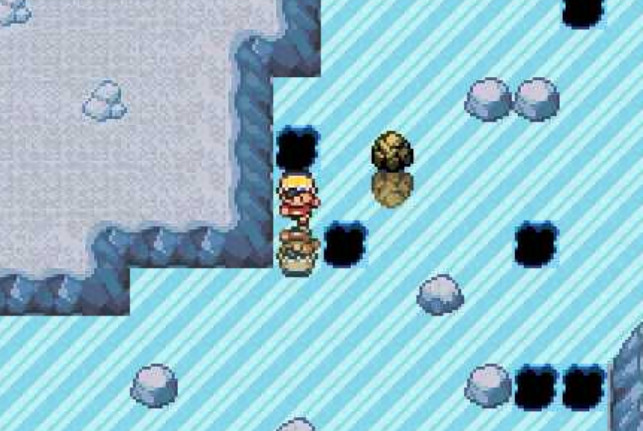

# Pokemon Maze (Part II)

Part I is here https://github.com/FeloVilches/Pokemon-Maze

This is a program made in Ruby that solves this kind of puzzle.



There are boulders, walls, holes, and where there's ice the character will slide from one point to another without being able to control its movement.

There's also normal land, where the character can move freely.

Holes make the character fall and of course that'd mean a route that goes through a hole wouldn't be a correct solution.

## Run all tests

Use the following command to run every test case.

```bash
bash ./test.sh
```

## Input

First two numbers are the starting cell (row, column).

Second line contains two numbers that represent the target cell.

After that, there can be any number of lines that represent each row of the map.

```
0 Ice
1 Wall (or boulder)
2 Normal land
3 Hole
```

An input example (it's read from `stdin`).

```
1 1
11 21
1 1 1 1 1 1 1 1 1 1 1 1 1 1 1 1 1 1 1 1 1 1 1
1 2 2 2 0 1 0 0 0 2 0 0 2 2 0 0 1 3 0 0 0 0 1
1 2 2 0 0 1 2 2 0 0 1 3 1 0 0 0 0 1 0 0 0 0 1
1 2 0 3 0 1 2 2 1 0 0 1 0 0 1 1 0 0 1 0 0 0 1
1 0 0 0 1 0 0 1 2 2 0 0 0 0 1 0 2 0 0 0 0 0 1
1 0 1 0 0 3 0 0 1 0 0 3 0 2 2 2 0 0 0 1 1 0 1
1 0 0 1 0 2 0 0 0 0 3 0 1 0 2 2 0 1 0 0 0 0 1
1 0 1 0 1 2 0 1 0 2 0 1 2 0 0 1 0 2 2 1 2 3 1
1 0 0 0 1 2 1 1 2 2 0 1 2 2 1 0 0 0 2 2 1 0 1
1 2 0 0 0 0 0 0 2 0 0 1 0 0 0 1 0 0 2 0 0 0 1
1 2 2 3 1 0 3 2 2 2 0 1 0 0 3 0 1 0 2 0 2 1 1
1 0 0 0 0 0 0 2 2 0 0 1 0 0 0 0 0 1 2 2 2 2 1
1 1 1 1 1 1 1 1 1 1 1 1 1 1 1 1 1 1 1 1 1 1 1
```

## Output

Output will be written to `stdout`. Example.

```
↓
↓
↓
→
↑
→
↑
↑
→
↓
→
→
→
↓
↓
→
↓
→
→
```

If there's no route, it will print `no`.
